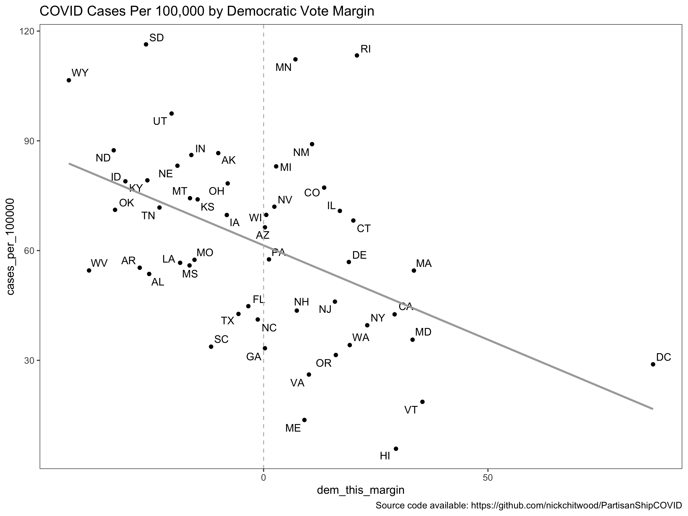

# Basic analysis of COVID Data

_Data visualization choices matter._ 

I had a friend post an interesting visualization that told a story about COVID-19 rates of infection and voter spread in the most recent election. The bar chart is pretty dramatic, and the way it clusters all of the "red" states together seems to be a pretty clear condemnation of the likely policies in those states.

However, the interesting choice was how to represent the two continuous variables: % of population with COVID, and victory margin. Population with COVID is the length of the bar, but the victory margin is represented as a color. This is weird, because usually two continuous variables are represented by a scatter plot. So I made one.

The relationship seems a little less obvious now, does it not? It's not gone. In fact, 22% of the variation in cases per 100,000 are associated with the Democratic vote margin, which is certainly interesting. But the overall story is less clear cut, on the scatter plot. Was this intentionally misleading on whoever created the infographic? Probably not. However, I think ultimately it belies the complexity of a pandemic for which the spread can't be neatly assigned to the voting populations preference for Trump vs. Biden.

